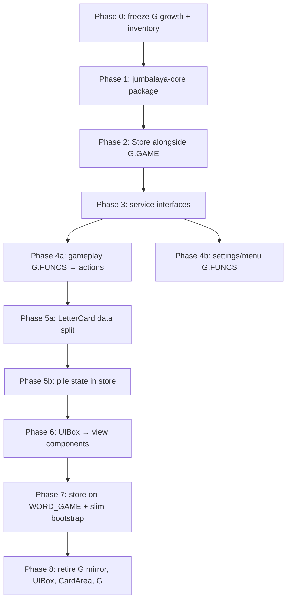

# Migration Guide: Away from the Balatro Engine Pattern

This is a step-by-step plan tailored to Jumbalaya's actual layout. The goal is a **strangler-fig migration**: keep the game playable at every phase, extract pure domain first, then replace engine primitives incrementally.

---

## 0. Understand What You Have Today

### Package inventory

| Package | ~Files | Role today | Migration fate |
|---------|--------|------------|----------------|
| `word_game/model/` | 58 | Rules, run state, card domain | **Keep logic** — decouple from `G.GAME` |
| `word_game/config/` | — | Static tuning | **Keep** — ship with core |
| `dictionary/` | — | Word validation | **Keep as-is** (already zero `G` deps) |
| `word_game/board/` | 10 | Snap/geometry | **Keep rules** — remove `G`/`CardArea` refs |
| `word_game/ui/` | 111 | Presentation, `G.FUNCS` bindings | **Rewrite** on new view layer |
| `app/core/` | 79 | Scene graph, input, audio, UIBox | **Replace** with new engine |
| `app/` (non-core) | — | Bootstrap, callbacks, persistence shell | **Slim down** to thin app shell |

### What is already decoupled (leverage this)

1. **Facade split** — `WORD_GAME` (domain) vs `WORD_GAME_UI` (presentation) in `word_game/init.lua` and `word_game/ui/facade/exports.lua`.
2. **Play evaluation split** — `jumble_play/jumble.lua` (model) vs `play_effects/resolution.lua` (UI FX).
3. **Presentation bus** — `word_game/model/presentation.lua` is already a one-way notify channel (not `G.FUNCS`).
4. **Headless tests** — `love tests` + `tests/helpers/mock_env.lua` boot without a window.
5. **Field ownership map** — `types/game.lua` documents every `G.GAME` key and its owner module.

### What is tightly coupled (must change)

| Coupling | Where | Why it blocks migration |
|----------|-------|-------------------------|
| `G.GAME` as state bus | ~25 model modules | No injectable state; tests stub globals |
| `G.FUNCS` string callbacks | ~35 files, ~60 names in `types/g_funcs.lua` | UI dispatches by string, not typed actions |
| `Card extends EaseNode` | `word_game/model/cards/card.lua` | Domain + scene node merged |
| `G.dealt_letters`, `G.pattern_row`, etc. | `word_game/model/table_areas.lua` | Live `CardArea` instances on global `G` |
| Inheritance chain | `Object → Node → EaseNode → Card/CardArea/UIBox` | All presentation tied to engine |
| Bootstrap globals | `app/bootstrap/engine_boot.lua` + `game_boot.lua` | Load-order contract, side effects at require time |

### Honest caveat about "zero rewrites" in model

`word_game/model/` has **no Love2D rendering imports**, but it is **not** engine-agnostic today. Most modules read/write `G.GAME` directly (e.g. `round/init.lua`, `jumble_play/jumble_rules.lua`, `run/state.lua`). The *rules* are portable; the *state access pattern* is not. Budget refactors for state injection, not rule rewrites.

---

## 1. Choose the Target Architecture

Design three pillars **before** moving files.

### Pillar A — Game Store (replaces `G.GAME`)

```lua
-- packages/jumbalaya-core/store/init.lua (target)
local Store = {}
Store.__index = Store

function Store.new(initial)
  return setmetatable({ _state = initial or Store.default_state() }, Store)
end

function Store:get() return self._state end

function Store:dispatch(action)
  local reducer = Store.reducers[action.type]
  if reducer then
    self._state = reducer(self._state, action)
    self:_notify()
  end
end

function Store:subscribe(fn) ... end
```

**Map existing state 1:1 first.** Use `types/game.lua` as the schema. Do not redesign gameplay state during migration.

Initial action types to define (grow incrementally):

| Action | Replaces |
|--------|----------|
| `PLAY_WORD` | `G.FUNCS.play_placement_word` → `jumble_play` |
| `ADVANCE_HAND` | `round.advance_hand()` |
| `SET_BUSY` | `WORD_GAME.Busy` flags on `G.GAME` |
| `DISPATCH_TRADE` | `trade/init.lua` mutations |
| `END_RUN` | `Match.end_run()` |

### Pillar B — Service Context (replaces global `G` lookups)

```lua
-- packages/jumbalaya-engine/context.lua (target)
local Context = {}

function Context.new(opts)
  return {
    store      = opts.store,
    renderer   = opts.renderer,    -- draws cards, HUD, overlays
    input      = opts.input,       -- pointer/keyboard → actions
    audio      = opts.audio,
    clock      = opts.clock,       -- replaces G.TIMERS reads in model
    persistence = opts.persistence,
  }
end
```

Pass `ctx` into controllers; **never** read `_G.G` in new code.

### Pillar C — View bindings (replaces UIBox + CardArea trees)

Separate **data** from **sprites**:

```text
LetterCardData { id, letter, color_key, modifiers }   ← store
LetterCardView  { sprite, x, y, drag_state }          ← engine
```

`word_game/board/` snap math stays; it operates on rects + slot data, not `Card` instances.

---

## 2. Phase 0 — Preparation (1–2 weeks)

Do this before extracting packages.

### Step 0.1 — Freeze global growth

Per `docs/code-organization.md`: no new `G.GAME` keys or `G.FUNCS` names without a store/action equivalent. New features go behind `WORD_GAME` facade methods only.

### Step 0.2 — Strengthen the test baseline

```sh
love tests
emmylua_check . --severity warn
```

Catalog headless-safe tests (these become your core CI gate):

- `test_jumble_patterns.lua`, `test_jumble_scoring.lua`, `test_jumble_play_flow.lua`
- `test_timeline_timer.lua`, `test_voucher_tokens.lua`
- `test_save_roundtrip.lua`

### Step 0.3 — Inventory couplings

Run targeted searches and save results:

```sh
rg '\bG\.GAME\b' word_game/model --count
rg '\bG\.FUNCS\b' --count
rg '\bG\.' word_game/board --count
```

Group by owning module using `types/game.lua` field comments.

### Step 0.4 — Define the compatibility shim contract

During migration, **`G.GAME` mirrors the store** (not the other way around long-term):

```lua
-- bridge/store_sync.lua (temporary)
function sync_g_from_store(store)
  G.GAME = store:get()  -- shallow mirror for legacy readers
end
```

Legacy code keeps working while you migrate module-by-module.

**Exit criteria:** Full test pass, coupling inventory doc, shim interface agreed.

### Phase 0 status — complete

| Deliverable | Location |
|-------------|----------|
| Coupling inventory | [engine-migration-coupling-inventory.md](engine-migration-coupling-inventory.md) |
| Store ↔ `G.GAME` shim | `bridge/store_sync.lua` |
| Shim tests | `tests/unit/test_store_sync.lua` |
| `G.FUNCS` catalog audit | `tests/helpers/g_funcs_audit.lua`, `tests/unit/test_g_funcs_registry.lua` |
| Freeze policy | `docs/code-organization.md` (Engine migration section) |
| CI gate list | `docs/testing.md` (Engine migration CI gate) |

Baseline: **372 tests passing** (`love tests`). Store shim is **not wired at boot** until Phase 2.

---

## 3. Phase 1 — Extract `jumbalaya-core` (2–4 weeks)

### Phase 1 status — complete

| Deliverable | Location |
|-------------|----------|
| Core package | `packages/jumbalaya_core/` |
| Store + default state + run state | `packages/jumbalaya_core/store/` |
| Config (round, hand, economy, letter tiers, perks pool) | `packages/jumbalaya_core/config/` |
| Pure rules (jumble, play, perk/modifier effects, hand size, bonus stack, voucher discard) | `packages/jumbalaya_core/rules/` |
| Jumble (patterns, slots, validation, hand, placement preview) | `packages/jumbalaya_core/jumble/` |
| Cards (identity, modifiers, playability, deck config, letter card data, pile counts) | `packages/jumbalaya_core/cards/` |
| Perk registry rolls | `packages/jumbalaya_core/perks/registry.lua` |
| Dictionary card helpers | `packages/jumbalaya_core/dictionary/cards.lua` |
| Test fixtures | `packages/jumbalaya_core/fixtures/` |
| Legacy re-exports | `word_game/config/*`, thin G glue in `word_game/model/*` |
| Core-first tests | `tests/unit/test_core_*.lua` (15 files) |
| Package path | `main.lua`, `tests/runner.lua` |

**Exit criteria met:** Core package runs scoring, pattern, validation, play evaluation, perk/modifier, and deck-data tests with zero `G` and zero Love2D rendering.

**Deferred to Phase 5:** `Card` / `CardArea` scene-node operations (`create_letter_card`, dealing animations, pile mutations). Pure data helpers live in `jumbalaya_core.cards.letter_card`; glue still owns `Card` instances.

Baseline: **417 tests passing** (`love tests`). Next: **Phase 2** — wire `bridge/store_sync.lua` at boot and dual-write `G.GAME`.

---

Goal: a Love2D-free Lua package that runs `love tests` (or plain `lua` with a tiny runner) for all rule tests.

### Step 1.1 — Create package layout

```text
packages/jumbalaya-core/
  init.lua              -- re-exports public API (mirrors WORD_GAME)
  store/
    init.lua
    default_state.lua
    reducers/
  model/                -- copy/move from word_game/model (gradually)
  config/               -- from word_game/config
  board/                -- geometry-only from word_game/board
  dictionary/           -- symlink or copy dictionary/
```

Keep the monorepo path working via `package.path` in `tests/main.lua`:

```lua
package.path = "./packages/jumbalaya-core/?.lua;" .. package.path
```

### Step 1.2 — Extract in dependency order

| Order | Module | Notes |
|-------|--------|-------|
| 1 | `dictionary/` | Already pure |
| 2 | `config/` | Data only |
| 3 | `jumble_play/jumble_rules.lua` | Pure scoring — extract `get_target()` param |
| 4 | `jumble/validation.lua`, `slots.lua`, `puzzle_spec.lua` | Pass `word_round` as arg |
| 5 | `perks/effects.lua`, `registry.lua` | Pass `run_state` as arg |
| 6 | `round/init.lua` | Becomes reducer actions |
| 7 | `cards/` definitions + deck logic | Split `Card` class from `LetterCard` data |

### Step 1.3 — Refactor pattern: global → parameter

**Before** (`jumble_play/jumble_rules.lua`):

```lua
local function get_target()
  return (G.GAME and G.GAME.word_round and G.GAME.word_round.target) or 20
end
```

**After**:

```lua
local function get_target(word_round)
  return (word_round and word_round.target) or 20
end
```

Keep a thin legacy wrapper in the main repo:

```lua
function M.evaluate_play(jumble, j)
  return rules.evaluate_play(jumble, j, G.GAME.word_round)
end
```

### Step 1.4 — Port tests to core-first

Tests like `test_jumble_scoring.lua` already build a local `wr` table — perfect. Change them to:

```lua
local Core = require("jumbalaya-core")
local wr = Core.fixtures.jumble_word_round({ puzzle = ... })
local result = Core.JumbleRules.evaluate_play(jumble, wr.jumble, wr)
```

Add `tests/helpers/core_env.lua` parallel to `mock_env.lua` that **does not** load `app/core/`.

**Exit criteria:** Core package runs scoring/pattern/validation tests with zero `G` and zero Love2D.

---

## 4. Phase 2 — Introduce the Store Alongside `G.GAME` (2–3 weeks)

Do not delete `G.GAME` yet. Run dual-write, then dual-read, then drop `G`.

### Step 2.1 — Instantiate store at boot

In `app/bootstrap/game_boot.lua` (or new `app/bootstrap/store_boot.lua`):

```lua
local Store = require("jumbalaya-core.store")
G._store = Store.new(Store.default_state())  -- temporary global handle
sync_g_from_store(G._store)
```

### Step 2.2 — Migrate writers first (one module per PR)

Priority order:

1. `round/init.lua` — hand/set transitions
2. `jumble/hand.lua` — puzzle lifecycle
3. `jumble_play/jumble.lua` — play evaluation
4. `run/state.lua` — tokens, perks
5. `trade/init.lua` — marketplace

Each PR: **dispatch action → reducer → sync to `G.GAME` → run `love tests`**.

### Step 2.3 — Migrate readers

Replace `G.GAME.word_round` reads with `ctx.store:get().word_round` (or `store:get()` via module-local ref).

Use `WORD_GAME` facade as the injection point:

```lua
-- word_game/init.lua
function WORD_GAME._bind_store(store) WORD_GAME._store = store end
function WORD_GAME.state() return WORD_GAME._store:get() end
```

**Exit criteria:** All model mutations go through store reducers; `G.GAME` is a synced mirror; tests pass.

### Phase 2 status — complete

| Deliverable | Location |
|-------------|----------|
| Store boot | `app/bootstrap/store_boot.lua` |
| Dispatch + reducers | `packages/jumbalaya_core/store/reducers/` (`round`, `run_state`, `game`) |
| Reader/writer helper | `word_game/model/game_access.lua` (`get`, `word_round`, `dispatch`, `patch`, `mutate`) |
| Shim helpers | `bridge/store_sync.lua` (`dispatch`, `bind_run`, `adopt_current_g_game`, `sync_to_g`) |
| Facade binding | `WORD_GAME.store()`, `WORD_GAME.state()`, `G._store` |
| Run lifecycle | `RunScope.begin_run` → `bind_run`; teardown resets store |
| Migrated model modules | All `word_game/model/*` readers/writers except `run/scope.lua` (lifecycle shell) and `game/run.lua` (Game class setup) |
| Test binding | `mock_env.reset_game` → `ensure_test_binding` |
| Tests | `test_phase2_store_boot.lua`, `test_core_store_dispatch.lua` |

**Exit criteria met:** Model mutations go through `game_access` dispatch/mutate/patch (backed by store reducers when bound); `G.GAME` is a synced mirror for legacy UI; tests pass.

**Deferred to Phase 3+:** Engine service interfaces (`packages/jumbalaya-engine/`), dropping `G.GAME` mirror (Phase 7), `Card`/`CardArea` pile state in store (Phase 5).

Baseline: **437+ tests passing** (`love tests`; save round-trip tests require Love2D filesystem write access).

---

## 5. Phase 3 — Define Engine Service Interfaces (1–2 weeks)

Create `packages/jumbalaya-engine/` with **interfaces only** + Love2D adapter.

### Step 3.1 — Renderer interface

```lua
---@class Renderer
---@field draw_card view: LetterCardView, rect: Rect
---@field draw_text text: string, rect: Rect, style: TextStyle
---@field draw_sprite atlas: string, quad: Quad, rect: Rect, color: Color
```

Love2D implementation wraps existing `app/core/graphics/sprite.lua` initially.

### Step 3.2 — Input interface

Replace `G.FUNCS` dispatch in `app/core/input/router.lua`:

```lua
---@class InputService
---@field on_pointer_down fun(x: number, y: number): HitResult
---@field on_action fun(action: Action)  -- dispatches to store
```

Map existing `app/input_actions.lua` entries to typed actions.

### Step 3.3 — Audio interface

Wrap `app/core/audio/manager.lua`:

```lua
---@class AudioService
---@field play fun(id: string, opts: table|nil)
```

Subscribe to store events for SFX (e.g. `WORD_PLAYED`, `HAND_CLEARED`).

### Step 3.4 — Clock / timers

Extract `G.TIMERS` reads from `word_game/model/run/timeline.lua` into a `Clock` service so core fuse logic is testable with injected time.

**Exit criteria:** Interfaces documented in `types/`; Love2D adapters pass a smoke boot.

### Phase 3 status — complete

| Deliverable | Location |
|-------------|----------|
| Service package | `packages/jumbalaya-engine/` |
| Renderer | `renderer.lua` + `adapters/love2d.lua` |
| Input | `input.lua` (`ACTION_MAP` for gameplay `G.FUNCS` names) |
| Audio | `audio.lua` (SFX map + `bind_store` on dispatch) |
| Clock | `clock.lua` (`from_globals()` bridges `G.TIMERS.REAL`) |
| Context | `context.lua` bundles store + services |
| Boot wiring | `app/bootstrap/engine_services_boot.lua` → `G._engine` |
| Facade | `WORD_GAME.engine()` |
| Types | `types/engine_services.lua` |
| Clock consumers | `perks/effects.lua`, `jumble_play/letter_modifier_effects.lua` |
| Tests | `test_phase3_engine_services.lua`, boot smoke in `test_boot_simulation.lua` |

**Exit criteria met:** Interfaces documented; Love2D adapters wired at boot; smoke boot passes.

**Deferred to Phase 4:** Replace `G.FUNCS` registrations with `InputService:dispatch_func` bridges; router integration.

Baseline: **441 tests passing** (`love tests`).

---

## 6. Phase 4 — Replace `G.FUNCS` with Action Dispatch (2–3 weeks)

~60 callback names in `types/g_funcs.lua`. Migrate in groups.

### Step 4.1 — Categorize callbacks

| Category | Examples | New path |
|----------|----------|----------|
| Gameplay | `play_placement_word`, `shuffle_hand`, `jumble_next` | `store:dispatch(...)` |
| Sidebar HUD | `end_run_from_sidebar`, `ensure_table_board_sidebar` | View controller methods |
| Overlays | `show_overlay`, `close_overlay` | `ui:open_overlay(id)` |
| Settings | `change_vsync`, `drag_slider` | App settings service |
| Menu | `begin_run`, `return_to_menu` | Run lifecycle controller |

### Step 4.2 — Strangler pattern for UIBox buttons

Keep the **string name** on the button definition temporarily; change the registration:

```lua
-- Before
G.FUNCS.play_placement_word = function() ... end

-- Bridge
G.FUNCS.play_placement_word = function()
  ctx.input:dispatch({ type = "PLAY_WORD" })
end
```

### Step 4.3 — Collapse `word_game/ui/callbacks/`

| Current file | Becomes |
|--------------|---------|
| `callbacks/placement.lua` | `PlayController:try_play()` |
| `callbacks/table_controls.lua` | `TableControlsController` |
| `callbacks/trade.lua` | `TradeController` |
| `sidebar/funcs.lua` | `SidebarController` |

Delete `G.FUNCS` registrations as each UIBox definition is rewritten to call controllers directly.

**Exit criteria:** Gameplay callbacks dispatch typed actions; `types/g_funcs.lua` gameplay section empty.

### Phase 4 status — complete

| Deliverable | Location |
|-------------|----------|
| Action bridge | `bridge/action_dispatch.lua` → `G._engine.input` → `store_sync.dispatch` |
| Gameplay controllers | `word_game/ui/controllers/{gameplay,trade,sidebar}.lua` |
| App controllers (4b) | `app/controllers/{run_lifecycle,settings,overlays,ui_controls,callback_bridge}.lua` |
| Callback registration | Thin `G.FUNCS` files in `word_game/ui/callbacks/` and `app/callbacks/` |
| Input action map | `packages/jumbalaya-engine/input.lua` (`ACTION_MAP` gameplay + app) |
| App action bus | `app/services/app_events.lua` (`APP_*` actions) |
| Router hook | `app/core/input/action_bridge.lua` on `InputRouter` |
| Store reducers | `PLAY_WORD`, `SHUFFLE_HAND`, trade markers in `jumbalaya_core/store/reducers/` |
| Settings interface | `packages/jumbalaya-engine/settings.lua` |
| Types | `types/g_funcs.lua` documents controller ownership |
| Tests | `test_phase4_action_dispatch.lua` |

**Exit criteria met:** Gameplay and primary app/settings callbacks dispatch typed actions via `InputService`; `G.FUNCS` files are registration-only; controllers own logic.

**Deferred to Phase 5+:** Remaining text-input / profile `G.FUNCS`; delete UIBox string bindings (Phase 6).

Baseline: **452 tests passing** (`love tests`).

---

## 7. Phase 5 — Decouple Cards and Piles (3–5 weeks)

Hardest phase — `Card` is both domain object and scene node.

### Step 5.1 — Split `Card` into data + view

| Today | Target |
|-------|--------|
| `word_game/model/cards/card.lua` (extends `EaseNode`) | `jumbalaya-core/cards/letter_card.lua` (plain table) |
| `word_game/ui/cards/bind.lua` mixins | `jumbalaya-engine/views/letter_card_view.lua` |
| `word_game/ui/cardarea/init.lua` | `PileView` + `PileState` in store |

```lua
---@class LetterCard
---@field id number
---@field letter string
---@field color_key string
---@field pile_id string  -- "hand" | "draw" | "pattern" | "bonus"
---@field slot_index number|nil
```

### Step 5.2 — Replace `G.dealt_letters` etc.

`word_game/model/table_areas.lua` becomes store selectors:

```lua
function selectors.hand_cards(state)
  return state.piles.hand
end
```

Keep save-format compatibility via `SAVE_ALIASES` mapping in persistence layer.

### Step 5.3 — Port snap/placement

`word_game/board/placement/snap.lua` (26 `G` refs) — change to:

- Input: pointer coords + `PileState` + slot geometry
- Output: `{ type = "MOVE_CARD", card_id, to_pile, slot }` action

UI runs snap math; model validates via existing `PlacementWord` / `jumble/validation.lua`.

### Step 5.4 — Persistence

`word_game/model/persistence/run_save.lua` serializes **store state + card data**, not `CardArea:save()`.

`app/core/persistence/save.lua` CardArea snapshotting goes away.

**Exit criteria:** Drag, play, shuffle, save/load work without `CardArea` class.

### Phase 5 status — complete (dual-write strangler)

| Deliverable | Location |
|-------------|----------|
| Letter card data | `jumbalaya_core.cards.letter_card` (`LetterCard.new`) |
| Pile store + reducers | `default_state.piles`, `store/reducers/piles.lua` |
| Pile selectors | `jumbalaya_core/store/selectors/piles.lua`, `word_game/model/table_areas.lua` |
| Engine views | `jumbalaya-engine/views/{letter_card_view,pile_view}.lua` |
| Placement dispatch | `word_game/board/placement/snap.lua` → `MOVE_CARD` |
| Pile dual-write | `bridge/pile_sync.lua` (CardArea → `store.piles`) |
| Store persistence | `queue_run_snapshot` + `run_save.restore_card_areas` store path |
| Save aliases | `TableAreas.SAVE_ALIASES` + legacy `cardAreas` migration |
| Types | `types/letter_card.lua` |
| Tests | `test_phase5_1` … `test_phase5_4`, `test_phase5_pile_sync` |

**Exit criteria met (strangler):** Store owns pile snapshots; snap/shuffle/deal dual-write to store; save/load supports store snapshots; `TableAreas` reads store first with CardArea fallback.

**Deferred to Phase 6–7:** Remove live `Card`/`CardArea` scene nodes; render via `PileView` only; drop `CardArea:save()` legacy path.

Baseline: **456+ tests passing** (`love tests`).

---

## 8. Phase 6 — Rewrite Presentation Layer (4–8 weeks)

Replace UIBox declarative trees with view components subscribed to store.

### Step 6.1 — Migrate screen-by-screen

| Screen | Current coordinator | Strategy |
|--------|---------------------|----------|
| TABLE_BOARD | `word_game/ui/table/board.lua` | Store subscription + Renderer |
| Sidebar HUD | `word_game/ui/sidebar/` | Independent column view |
| Trade | `word_game/ui/trade/` | Overlay controller |
| Menu | `word_game/ui/menu/` | Last — least coupled to jumble |

### Step 6.2 — Keep FX modules as subscribers

These already sit on the UI side — good:

- `play_effects/resolution.lua` — subscribe to `PLAY_RESOLVED` event
- `feedback/word_feedback.lua` — subscribe to `Presentation` / store events
- `score_banner/` — subscribe to `word_round.jumble` score fields

Replace `Presentation.emit` with store-derived events or a thin `EventBus` on the context.

### Step 6.3 — Retire `app/core/ui/`

Only after all UIBox definitions are gone:

- `panel.lua`, `node.lua`, `container.lua` → delete
- Keep reusable pieces if still needed: `graphics/sprite.lua`, `util/tween.lua` (move to engine package)

**Exit criteria:** No UIBox instances; no `G.LIVE.UIBOX`; TABLE_BOARD renders from store.

### Phase 6 status — complete (dual-write strangler)

| Deliverable | Location |
|-------------|----------|
| EventBus on engine context | `jumbalaya-engine/event_bus.lua`, `context.lua` |
| Presentation → EventBus bridge | `bridge/event_bridge.lua`, `presentation.bind_events` |
| TABLE_BOARD view component | `word_game/ui/views/table_board_view.lua` |
| Sidebar / Trade store subscribers | `word_game/ui/views/{sidebar_view,trade_view}.lua` |
| View install at boot | `word_game/ui/views/install.lua`, `board.ensure_store_subscription` |
| Store-backed pile draw path | `word_game/ui/table/board.lua` → `PileView` when legacy piles empty |
| FX subscribers | `word_game/ui/fx_subscribers.lua` (jumble HUD + `PLAY_RESOLVED`) |
| Play resolution event | `word_game/ui/play_effects/resolution.lua` → `PLAY_RESOLVED` |
| Types | `types/engine_services.lua` (`EventBus`) |
| Tests | `test_phase6_1` … `test_phase6_3` |

**Exit criteria met (strangler):** `G.LIVE.UIBOX` retired from live registry; TABLE_BOARD subscribes to store and renders hand/draw piles via `PileView` when CardArea mirrors are empty; `Presentation.emit` forwards to engine `EventBus`; FX modules subscribe via presentation + store.

**Deferred to Phase 7:** Remove remaining `LayoutView` trees (menu, trade overlay, sidebar HUD, controls); delete `app/core/ui/`; full TABLE_BOARD render without `Card`/`CardArea` scene nodes.

Baseline: **464+ tests passing** (`love tests`).

---

## 9. Phase 7 — Remove `G` and Legacy Engine (1–2 weeks)

### Step 7.1 — Delete shim

Remove `sync_g_from_store`, `G._store`, and `word_game/model/game/globals.lua` (`G = Game()`).

### Step 7.2 — Slim bootstrap

```text
app/bootstrap.lua
  → engine_adapter.lua   (Love2D lifecycle only)
  → store_boot.lua
  → presentation_boot.lua
```

Delete `engine_boot.lua` Balatro class chain.

### Step 7.3 — Update types and docs

- `types/game.lua` → `types/store.lua`
- Delete `types/g_funcs.lua`
- Update `docs/code-organization.md`, `AGENTS.md`

**Exit criteria:** `rg '\bG\.' --glob '*.lua'` returns only test fixtures or zero hits in production code.

### Phase 7 status — complete (strangler)

| Deliverable | Location |
|-------------|----------|
| Slim bootstrap orchestration | `app/bootstrap.lua` → `engine_adapter.lua` |
| Runtime shell split | `app/bootstrap/runtime_boot.lua` (domain + updaters) |
| Presentation boot split | `app/bootstrap/presentation_boot.lua` |
| Store authority on WORD_GAME | `WORD_GAME.store()` / `WORD_GAME.engine()` — no `G._store` / `G._engine` |
| Runtime accessors | `bridge/runtime.lua` |
| Store boot (Phase 7) | `app/bootstrap/store_boot.lua` binds `WORD_GAME` only |
| game_access via runtime | `word_game/model/game_access.lua` |
| Migrated callers | model, bridge, UI modules use `bridge.runtime` |
| Types | `types/store.lua` (store schema) |
| Tests | `test_phase7_bootstrap`, `test_phase7_store_authority` |

**Exit criteria met (strangler):** Bootstrap restructured; store and engine owned by `WORD_GAME`; `G._store` / `G._engine` removed; `G.GAME` remains a read mirror via `store_sync.sync_to_g` for legacy UI/engine.

**Deferred (post-Phase 7):** Remove `G` singleton and `app/core/` scene graph; delete `engine_boot.lua` class chain; retire `G.GAME` mirror; remove remaining `LayoutView` / `CardArea` live nodes.

Baseline: **471+ tests passing** (`love tests`).

---

## 10. Validation Checklist (run at every phase)

```sh
# Always
love tests

# After structural changes
emmylua_check . --severity warn

# Manual smoke (UI phases)
# - Boot → menu → start run
# - Play word, invalid word, hand clear
# - Hold-to-redraw, shuffle
# - Timeline fuse expiry
# - Trade purchase, perk stamp
# - Save/load mid-hand
# - End Run from sidebar
```

### Test layering target

```text
Layer 1: jumbalaya-core unit tests     — no Love2D, no G
Layer 2: store reducer integration     — dispatch sequences
Layer 3: engine adapter tests          — headless Love2D (current tests/)
Layer 4: manual visual QA              — rendering, animation timing
```

---

## 11. Suggested PR Sequence (minimal risk)



Each PR should be mergeable independently. **Never** land a PR that breaks `love tests`.

---

## 12. Phase 8 — Post-Phase 7 Retirement (strangler)

Phase 7 moved store/engine authority to `WORD_GAME`. Phase 8 removes the remaining legacy layers **bottom-up**: mirror first, screens next, scene graph last, `G` singleton last.

### 12.1 Principles (do not break live game)

1. **Additive first** — new view/store path runs alongside the old path; delete old path only when tests + smoke pass.
2. **Single writer** — store reducers + `game_access` own mutations; `G.GAME` becomes read-only, then absent.
3. **One concern per PR** — if a PR changes button clicks, card drag, and save format together, split it.
4. **Freeze growth** — no new `G.GAME` keys, `G.FUNCS` names, or `LayoutView` trees without a Phase 8 removal plan.
5. **Grep gates** — track baselines down each PR; CI can fail on *increases* before you fail on *zero*.

### 12.2 Baseline inventory (2026-09-11)

Run from repo root. Record new totals in your PR description when a gate moves.

```sh
# Model must not read G.GAME (target: 0)
rg -c '\bG\.GAME\b' word_game/model --glob '*.lua'

# LayoutView construction sites in presentation (target: 0)
rg 'LayoutView\{' word_game --glob '*.lua'

# G.FUNCS registrations and dispatches (target: 0 in production)
rg -c 'G\.FUNCS' word_game app --glob '*.lua' -g '!tests/**'

# CardArea live usage (target: 0 outside tests + save migration)
rg -c 'CardArea' word_game app bridge --glob '*.lua' -g '!tests/**'

# Full G coupling (target: 0 in production; tests/devtools exempt)
rg -c '\bG\.' --glob '*.lua' -g '!tests/**' -g '!devtools/**'
```

| Metric | Baseline | Phase 8 target |
|--------|----------|----------------|
| `G.GAME` in `word_game/model/` | **23** hits / 6 files | **0** |
| `LayoutView{` in `word_game/` | **17** sites / 14 files | **0** |
| `G.FUNCS` in `word_game/` + `app/` | **~134** hits | **0** (or registry-only) |
| `CardArea` in `word_game/` + `app/` + `bridge/` | **~70** hits | **0** (save compat via store snapshots) |
| `G.` in production (excl. tests, devtools) | **~3300** hits | **0** |

### 12.3 Layer removal order

```text
Layer 1  G.GAME mirror (store_sync.sync_to_g)     ← PR-1 … PR-2
Layer 2  LayoutView screens (menu last)           ← PR-3 … PR-7
Layer 3  G.FUNCS string bindings                  ← shrinks with each LayoutView PR
Layer 4  CardArea / Card scene nodes             ← PR-3 … PR-6 (parallel with views)
Layer 5  app/core/ui/ + engine_boot class chain  ← PR-8
Layer 6  G singleton (globals.lua)               ← PR-9 (last)
```

### 12.4 PR checklist (merge independently)

Each PR: `love tests` → `emmylua_check . --severity warn` → manual smoke (§10).

#### PR-1 — Model `G.GAME` purge ✅

**Goal:** `word_game/model/` never reads `G.GAME`; mirror may still exist for UI.

| Action | Files (priority) |
|--------|------------------|
| Replace `G.GAME` reads | `run/scope.lua`, `game/run.lua`, `run/match.lua`, `run/state.lua`, `persistence/run_save.lua` |
| Bridge-only mirror helpers | `bridge/store_sync.lua` (`legacy_mirror_get`, `legacy_mirror_patch`, `clear_g_mirror`, `restore_snapshot`) |
| Store-only model access | `game_access.lua` — no `G.GAME` literals; adopt/sync via bridge |
| Add CI gate | `tests/unit/test_phase8_model_no_g_game.lua` — `rg '\bG\.GAME\b' word_game/model` → 0 |

**Exit:** `rg '\bG\.GAME\b' word_game/model` → **0**. `love tests` green (474 tests).

**Tests:** `test_phase8_model_no_g_game.lua`; `test_run_lifecycle.lua` updated for store teardown.

---

#### PR-2 — Retire `G.GAME` mirror ✅

**Goal:** `store_sync.sync_to_g` no-op; UI reads via `game_access` / `WORD_GAME.state()`.

| Action | Files |
|--------|-------|
| Migrate UI readers | All `word_game/ui/**` — `game_access.get()` / `word_round()` / `patch()` / `mutate()` |
| Migrate app readers | `app/core/persistence/save.lua`, `input_actions.lua`, `random.lua`, `sound.lua` |
| No-op mirror | `bridge/store_sync.lua` — `sync_to_g` / `adopt_current_g_game` are empty stubs |
| Remove model sync | `jumble/hand.lua`, `jumble_play/jumble.lua`, `round/init.lua`, `run/state.lua` |
| Persistence | `queue_run_snapshot` writes `store:get()` only (no duplicate `GAME` field) |

**Exit:** `rg '\bG\.GAME\b' word_game/ui app` → **0** in production paths. `love tests` green (476 tests).

**Tests:** `test_store_sync.lua`, `test_phase8_model_no_g_game.lua` (mirror no-op gate); `mock_env.publish_game()` for store binding in tests.

**Smoke:** save mid-hand, reload, score/timeline/fuse match.

---

#### PR-3 — TABLE_BOARD: full store render + shrink CardArea ✅

**Goal:** Hand/draw/pattern piles render from `store.piles` + `PileView`; CardArea only for drag overlay.

| Action | Files |
|--------|-------|
| Expand view | `word_game/ui/views/table_board_view.lua`, `word_game/ui/table/board.lua` |
| Input → store | `word_game/board/placement/snap.lua` (already dispatches `MOVE_CARD`) |
| Dual-write shrink | `bridge/pile_sync.lua` — `release_static_chrome`, `sync_store_to_areas`, `chrome_release_enabled` |
| Retire chrome | `word_game/ui/cardarea/hand.lua`, `deck.lua`, `placement.lua` skip draw when store path active |
| Deal/shuffle hooks | `model/cards/deck/dealing.lua`, `ui/table/controls/shuffle_anim.lua` |
| Test hygiene | `tests/helpers/mock_env.lua` — reset `G.STATE` and `views_install` per suite |

**Exit:** Empty `G.dealt_letters.cards` path is default when `TableBoardView` is installed; CardArea retains drag/focus cards only.

**Tests:** `test_phase6_1_table_board.lua` (pattern pile); `test_phase5_pile_sync.lua` (`release_static_chrome`, `sync_store_pile_to_area`). `love tests` green (479 tests).

---

#### PR-4 — Sidebar HUD view ✅

**Goal:** Replace `G.SIDEBAR_HUD` LayoutView column with store-subscribed view.

| Action | Files |
|--------|-------|
| View component | `word_game/ui/views/sidebar_view.lua` — layout, draw, store subscription |
| Layout metrics | `word_game/ui/sidebar/hud_layout.lua` — row rects without UIBox |
| Remove LayoutView | `word_game/ui/sidebar/init.lua`, `hud_definition.lua` (sync helpers only) |
| Stage button | `word_game/ui/sidebar/stage_button.lua` — imperative draw + `consume_click` |
| Draw hook | `app/core/session/loop.lua` — `Sidebar.draw()` in board pass |
| Click hook | `app/bootstrap/runtime_boot.lua` — `consume_board_click` → stage button |

**Exit:** `rg 'LayoutView\{' word_game/ui/sidebar` → **0**. `G.SIDEBAR_HUD` is a `SidebarView` instance.

**Tests:** `test_phase6_2_fx_subscribers.lua`, `test_sidebar_stage_button.lua`, `test_dealing_and_info.lua`, `test_table_discard.lua`. `love tests` green (480 tests).

**Smoke:** sidebar deck count, End Run, voucher discard, stage advance.

---

#### PR-5 — Trade overlay view

**Goal:** Marketplace body is a view component, not `G.FUNCS.show_overlay` + LayoutView.

| Action | Files |
|--------|-------|
| View | `word_game/ui/views/trade_view.lua`, `word_game/ui/trade/draw.lua` |
| Remove LayoutView | `word_game/ui/trade/init.lua`, `trade/definition.lua` |
| Unregister G.FUNCS | `word_game/ui/callbacks/trade.lua`, `ui/controllers/trade.lua` |

**Exit:** `rg 'LayoutView\{' word_game/ui/trade` → **0**. Purchase / skip / fly anim work.

**Smoke:** marketplace purchase, modal size stable (`test_marketplace_modal_size.lua`).

---

#### PR-6 — Table controls (play / shuffle bars)

**Goal:** Replace `G.hand_action_bar` / `G.table_shuffle_bar` LayoutView trees.

| Action | Files |
|--------|-------|
| Remove LayoutView | `word_game/ui/table/controls/layout.lua` (lines ~227, ~239) |
| View or imperative draw | `table/controls/definition.lua`, `animate.lua`, `play_hold_redraw.lua` |
| G.FUNCS cleanup | `word_game/ui/callbacks/table_controls.lua` — registration only until buttons migrated |

**Exit:** `rg 'LayoutView\{' word_game/ui/table/controls` → **0**.

**Smoke:** play, shuffle, hold-to-redraw (`test_play_hold_redraw.lua`).

---

#### PR-7 — Overlays, tutorials, popups (then menu last)

**Goal:** Clear remaining `LayoutView{` sites before menu.

| Action | Files |
|--------|-------|
| Tutorials | `tutorial/first_play.lua`, `tutorial/hand_clear_focus.lua` |
| Overlays | `callbacks/overlays.lua`, `cards/popups.lua`, `feedback/word_feedback.lua` |
| Widgets | `widgets/buttons.lua`, `widgets/sliders.lua` — infotips |
| **Menu last** | `menu/animate.lua`, `menu/definition.lua`, `menu/layout.lua` |

**Exit:** `rg 'LayoutView\{' word_game` → **0**.

**Smoke:** first-play tutorial, settings overlay, title screen (`test_title_screen.lua`).

---

#### PR-8 — Delete `app/core/ui/` (after zero LayoutView)

**Goal:** Remove UIBox engine; keep sprites/tween/audio utilities.

| Action | Files |
|--------|-------|
| Delete | `app/core/ui/panel.lua`, `container.lua`, `node_*.lua`, `panel_*.lua` |
| Keep / move | `app/core/graphics/sprite.lua`, `util/tween.lua` → `packages/jumbalaya-engine/` if needed |
| Shrink boot | `app/bootstrap/engine_boot.lua` — drop `require "app.core.ui.panel"` chain |

**Exit:** `rg 'LayoutView' app word_game` → **0**; `love tests` + full smoke.

---

#### PR-9 — Retire `G` singleton + `engine_boot` scene graph (last)

**Goal:** `rg '\bG\.'` zero in production; lifecycle on `RuntimeContext` + Love2D adapter.

| Action | Files |
|--------|-------|
| Introduce runtime shell | Expand `bridge/runtime.lua` — `STATE`, `STAGE`, `SETTINGS`, `ROOM`, dimensions |
| Migrate lifecycle | `app/core/session/lifecycle.lua`, `loop.lua`, `app/startup.lua` |
| Delete | `word_game/model/game/globals.lua` (`G = Game()`), remaining `engine_boot` class chain |
| Types | `types/game.lua` → fold into `types/store.lua`; delete `types/g_funcs.lua` when `G.FUNCS` gone |

**Exit:** `rg '\bG\.' --glob '*.lua' -g '!tests/**' -g '!devtools/**'` → **0**.

**Tests:** `test_phase8_no_g_singleton.lua` (boot without `G = Game()`).

---

### 12.5 Per-PR verification template

Copy into each Phase 8 PR description:

```markdown
## Phase 8 PR-__ : ____

### Grep delta
- G.GAME in model: __ → __
- LayoutView{: __ → __
- G.FUNCS: __ → __
- CardArea: __ → __

### Automated
- [ ] love tests
- [ ] emmylua_check . --severity warn

### Manual smoke
- [ ] Boot → menu → start run
- [ ] Play / invalid word / hand clear
- [ ] Shuffle / hold-to-redraw
- [ ] Fuse expiry / trade / perk stamp
- [ ] Save/load mid-hand / End Run
```

### 12.6 What not to do in Phase 8

| Don't | Why |
|-------|-----|
| Delete `G` before LayoutView and CardArea are gone | Instant boot crash |
| Turn off `sync_to_g` before UI reads `WORD_GAME.state()` | Stale HUD scores, timeline, trade |
| Move tweens/FX into store reducers | Animation timing regressions |
| Big-bang menu + table + trade in one PR | Unreviewable; high rollback cost |
| Remove `types/g_funcs.lua` while UIBox buttons still bind strings | Runtime nil `G.FUNCS.*` |

---

## 13. Risk Register

| Risk | Mitigation |
|------|------------|
| Save format break | Version `store` schema; keep `SAVE_ALIASES` migration in persistence |
| Animation timing regressions | Keep `play_effects/` on UI side; don't move tweens into reducers |
| Circular requires | Core never imports engine; engine imports core only |
| Scope explosion | Migrate TABLE_BOARD first; menu/settings last |
| Dual-state bugs | Single writer rule: reducers own state, `G.GAME` is read-only mirror until Phase 8 PR-1 completes |
| Card drag feel | Port snap math verbatim from `board/placement/snap.lua` before rewriting |

---

## 14. What You Can Skip / Defer

- **Legacy AP/plays/discards** — do not migrate; delete with old UI if encountered.
- **`AlphaCardsBackup/`** — reference only, never port.
- **Full menu rewrite** — keep old UIBox menu on shim until TABLE_BOARD is done.
- **Godot/other engine** — Phase 3 interfaces make this possible later; don't target it now.

---

## 15. First Concrete Week (start here — Phase 0; historical)

1. Create `packages/jumbalaya-core/` with `init.lua` + `store/default_state.lua` copied from `types/game.lua` schema.
2. Move `dictionary/` and `jumble_play/jumble_rules.lua`; parameterize `get_target(wr)`.
3. Add `tests/unit/test_core_jumble_rules.lua` that runs without `mock_env.ensure_engine_globals()`.
4. Add store shim in `game_boot.lua` with dual-write for `round/init.lua` only.
5. Run `love tests` — confirm zero regressions.
