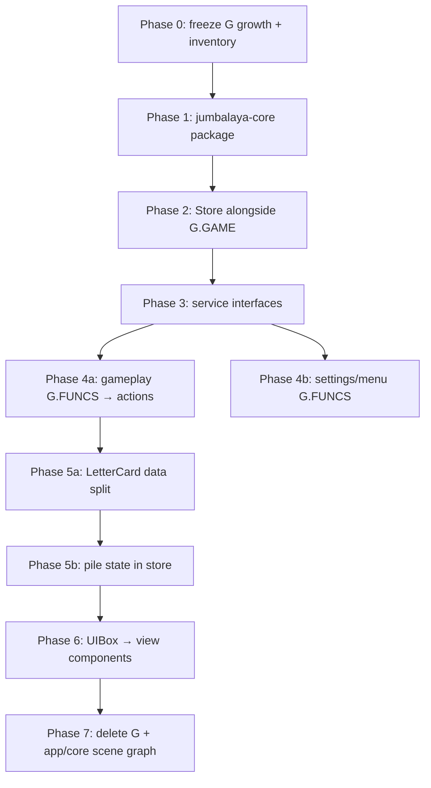

# Migration Guide: Away from the Balatro Engine Pattern

This is a step-by-step plan tailored to Jumbalaya's actual layout. The goal is a **strangler-fig migration**: keep the game playable at every phase, extract pure domain first, then replace engine primitives incrementally.

---

## 0. Understand What You Have Today

### Package inventory

| Package | ~Files | Role today | Migration fate |
|---------|--------|------------|----------------|
| `word_game/model/` | 58 | Rules, run state, card domain | **Keep logic** — decouple from `G.GAME` |
| `word_game/config/` | — | Static tuning | **Keep** — ship with core |
| `dictionary/` | — | Word validation | **Keep as-is** (already zero `G` deps) |
| `word_game/board/` | 10 | Snap/geometry | **Keep rules** — remove `G`/`CardArea` refs |
| `word_game/ui/` | 111 | Presentation, `G.FUNCS` bindings | **Rewrite** on new view layer |
| `app/core/` | 79 | Scene graph, input, audio, UIBox | **Replace** with new engine |
| `app/` (non-core) | — | Bootstrap, callbacks, persistence shell | **Slim down** to thin app shell |

### What is already decoupled (leverage this)

1. **Facade split** — `WORD_GAME` (domain) vs `WORD_GAME_UI` (presentation) in `word_game/init.lua` and `word_game/ui/facade/exports.lua`.
2. **Play evaluation split** — `jumble_play/jumble.lua` (model) vs `play_effects/resolution.lua` (UI FX).
3. **Presentation bus** — `word_game/model/presentation.lua` is already a one-way notify channel (not `G.FUNCS`).
4. **Headless tests** — `love tests` + `tests/helpers/mock_env.lua` boot without a window.
5. **Field ownership map** — `types/game.lua` documents every `G.GAME` key and its owner module.

### What is tightly coupled (must change)

| Coupling | Where | Why it blocks migration |
|----------|-------|-------------------------|
| `G.GAME` as state bus | ~25 model modules | No injectable state; tests stub globals |
| `G.FUNCS` string callbacks | ~35 files, ~60 names in `types/g_funcs.lua` | UI dispatches by string, not typed actions |
| `Card extends EaseNode` | `word_game/model/cards/card.lua` | Domain + scene node merged |
| `G.dealt_letters`, `G.pattern_row`, etc. | `word_game/model/table_areas.lua` | Live `CardArea` instances on global `G` |
| Inheritance chain | `Object → Node → EaseNode → Card/CardArea/UIBox` | All presentation tied to engine |
| Bootstrap globals | `app/bootstrap/engine_boot.lua` + `game_boot.lua` | Load-order contract, side effects at require time |

### Honest caveat about "zero rewrites" in model

`word_game/model/` has **no Love2D rendering imports**, but it is **not** engine-agnostic today. Most modules read/write `G.GAME` directly (e.g. `round/init.lua`, `jumble_play/jumble_rules.lua`, `run/state.lua`). The *rules* are portable; the *state access pattern* is not. Budget refactors for state injection, not rule rewrites.

---

## 1. Choose the Target Architecture

Design three pillars **before** moving files.

### Pillar A — Game Store (replaces `G.GAME`)

```lua
-- packages/jumbalaya-core/store/init.lua (target)
local Store = {}
Store.__index = Store

function Store.new(initial)
  return setmetatable({ _state = initial or Store.default_state() }, Store)
end

function Store:get() return self._state end

function Store:dispatch(action)
  local reducer = Store.reducers[action.type]
  if reducer then
    self._state = reducer(self._state, action)
    self:_notify()
  end
end

function Store:subscribe(fn) ... end
```

**Map existing state 1:1 first.** Use `types/game.lua` as the schema. Do not redesign gameplay state during migration.

Initial action types to define (grow incrementally):

| Action | Replaces |
|--------|----------|
| `PLAY_WORD` | `G.FUNCS.play_placement_word` → `jumble_play` |
| `ADVANCE_HAND` | `round.advance_hand()` |
| `SET_BUSY` | `WORD_GAME.Busy` flags on `G.GAME` |
| `DISPATCH_TRADE` | `trade/init.lua` mutations |
| `END_RUN` | `Match.end_run()` |

### Pillar B — Service Context (replaces global `G` lookups)

```lua
-- packages/jumbalaya-engine/context.lua (target)
local Context = {}

function Context.new(opts)
  return {
    store      = opts.store,
    renderer   = opts.renderer,    -- draws cards, HUD, overlays
    input      = opts.input,       -- pointer/keyboard → actions
    audio      = opts.audio,
    clock      = opts.clock,       -- replaces G.TIMERS reads in model
    persistence = opts.persistence,
  }
end
```

Pass `ctx` into controllers; **never** read `_G.G` in new code.

### Pillar C — View bindings (replaces UIBox + CardArea trees)

Separate **data** from **sprites**:

```text
LetterCardData { id, letter, color_key, modifiers }   ← store
LetterCardView  { sprite, x, y, drag_state }          ← engine
```

`word_game/board/` snap math stays; it operates on rects + slot data, not `Card` instances.

---

## 2. Phase 0 — Preparation (1–2 weeks)

Do this before extracting packages.

### Step 0.1 — Freeze global growth

Per `docs/code-organization.md`: no new `G.GAME` keys or `G.FUNCS` names without a store/action equivalent. New features go behind `WORD_GAME` facade methods only.

### Step 0.2 — Strengthen the test baseline

```sh
love tests
emmylua_check . --severity warn
```

Catalog headless-safe tests (these become your core CI gate):

- `test_jumble_patterns.lua`, `test_jumble_scoring.lua`, `test_jumble_play_flow.lua`
- `test_timeline_timer.lua`, `test_voucher_tokens.lua`
- `test_save_roundtrip.lua`

### Step 0.3 — Inventory couplings

Run targeted searches and save results:

```sh
rg '\bG\.GAME\b' word_game/model --count
rg '\bG\.FUNCS\b' --count
rg '\bG\.' word_game/board --count
```

Group by owning module using `types/game.lua` field comments.

### Step 0.4 — Define the compatibility shim contract

During migration, **`G.GAME` mirrors the store** (not the other way around long-term):

```lua
-- bridge/store_sync.lua (temporary)
function sync_g_from_store(store)
  G.GAME = store:get()  -- shallow mirror for legacy readers
end
```

Legacy code keeps working while you migrate module-by-module.

**Exit criteria:** Full test pass, coupling inventory doc, shim interface agreed.

### Phase 0 status — complete

| Deliverable | Location |
|-------------|----------|
| Coupling inventory | [engine-migration-coupling-inventory.md](engine-migration-coupling-inventory.md) |
| Store ↔ `G.GAME` shim | `bridge/store_sync.lua` |
| Shim tests | `tests/unit/test_store_sync.lua` |
| `G.FUNCS` catalog audit | `tests/helpers/g_funcs_audit.lua`, `tests/unit/test_g_funcs_registry.lua` |
| Freeze policy | `docs/code-organization.md` (Engine migration section) |
| CI gate list | `docs/testing.md` (Engine migration CI gate) |

Baseline: **372 tests passing** (`love tests`). Store shim is **not wired at boot** until Phase 2.

---

## 3. Phase 1 — Extract `jumbalaya-core` (2–4 weeks)

### Phase 1 status — in progress (slice 3 complete)

| Deliverable | Location |
|-------------|----------|
| Core package | `packages/jumbalaya_core/` |
| Store + default state | `packages/jumbalaya_core/store/` |
| Round config (canonical) | `packages/jumbalaya_core/config/gameplay/round.lua` |
| Pure jumble rules + perk math | `packages/jumbalaya_core/rules/` |
| Jumble patterns + slots + validation | `packages/jumbalaya_core/jumble/` |
| Hand lifecycle + round reducers | `packages/jumbalaya_core/jumble/hand.lua`, `packages/jumbalaya_core/round/` |
| Dictionary card helpers | `packages/jumbalaya_core/dictionary/cards.lua` |
| Test fixtures | `packages/jumbalaya_core/fixtures/` |
| Legacy re-export | `word_game/config/gameplay/round.lua` → core |
| G glue layers | `word_game/model/jumble_play/jumble_rules.lua`, `word_game/model/jumble/*`, `word_game/model/round/init.lua` |
| Core-first tests | `tests/unit/test_core_*.lua` (rules, patterns, hand, round, dictionary cards) |
| Package path | `main.lua`, `tests/runner.lua` |

**Done (slice 1):** dictionary re-export, round config, jumble scoring rules, perk multiplier math, store skeleton.

**Done (slice 2):** `slot_topology`, `puzzle_spec`, `slots`, `validation` extracted to core; word_game jumble modules are thin G glue.

**Done (slice 3):** `jumble/hand.lua`, `round/init.lua` reducers, dictionary letter helpers; `build_score_opts` passes `used_cards` through to core scoring.

**In progress (slice 4):** cards/deck logic split — `LetterCard` data vs `Card` scene node. Pure card helpers live in `packages/jumbalaya_core/cards/` (`identity`, `letter_modifiers`, `playability`, `deck_config`, `letter_card`).

Baseline: **412 tests passing** (`love tests`).

---

Goal: a Love2D-free Lua package that runs `love tests` (or plain `lua` with a tiny runner) for all rule tests.

### Step 1.1 — Create package layout

```text
packages/jumbalaya-core/
  init.lua              -- re-exports public API (mirrors WORD_GAME)
  store/
    init.lua
    default_state.lua
    reducers/
  model/                -- copy/move from word_game/model (gradually)
  config/               -- from word_game/config
  board/                -- geometry-only from word_game/board
  dictionary/           -- symlink or copy dictionary/
```

Keep the monorepo path working via `package.path` in `tests/main.lua`:

```lua
package.path = "./packages/jumbalaya-core/?.lua;" .. package.path
```

### Step 1.2 — Extract in dependency order

| Order | Module | Notes |
|-------|--------|-------|
| 1 | `dictionary/` | Already pure |
| 2 | `config/` | Data only |
| 3 | `jumble_play/jumble_rules.lua` | Pure scoring — extract `get_target()` param |
| 4 | `jumble/validation.lua`, `slots.lua`, `puzzle_spec.lua` | Pass `word_round` as arg |
| 5 | `perks/effects.lua`, `registry.lua` | Pass `run_state` as arg |
| 6 | `round/init.lua` | Becomes reducer actions |
| 7 | `cards/` definitions + deck logic | Split `Card` class from `LetterCard` data |

### Step 1.3 — Refactor pattern: global → parameter

**Before** (`jumble_play/jumble_rules.lua`):

```lua
local function get_target()
  return (G.GAME and G.GAME.word_round and G.GAME.word_round.target) or 20
end
```

**After**:

```lua
local function get_target(word_round)
  return (word_round and word_round.target) or 20
end
```

Keep a thin legacy wrapper in the main repo:

```lua
function M.evaluate_play(jumble, j)
  return rules.evaluate_play(jumble, j, G.GAME.word_round)
end
```

### Step 1.4 — Port tests to core-first

Tests like `test_jumble_scoring.lua` already build a local `wr` table — perfect. Change them to:

```lua
local Core = require("jumbalaya-core")
local wr = Core.fixtures.jumble_word_round({ puzzle = ... })
local result = Core.JumbleRules.evaluate_play(jumble, wr.jumble, wr)
```

Add `tests/helpers/core_env.lua` parallel to `mock_env.lua` that **does not** load `app/core/`.

**Exit criteria:** Core package runs scoring/pattern/validation tests with zero `G` and zero Love2D.

---

## 4. Phase 2 — Introduce the Store Alongside `G.GAME` (2–3 weeks)

Do not delete `G.GAME` yet. Run dual-write, then dual-read, then drop `G`.

### Step 2.1 — Instantiate store at boot

In `app/bootstrap/game_boot.lua` (or new `app/bootstrap/store_boot.lua`):

```lua
local Store = require("jumbalaya-core.store")
G._store = Store.new(Store.default_state())  -- temporary global handle
sync_g_from_store(G._store)
```

### Step 2.2 — Migrate writers first (one module per PR)

Priority order:

1. `round/init.lua` — hand/set transitions
2. `jumble/hand.lua` — puzzle lifecycle
3. `jumble_play/jumble.lua` — play evaluation
4. `run/state.lua` — tokens, perks
5. `trade/init.lua` — marketplace

Each PR: **dispatch action → reducer → sync to `G.GAME` → run `love tests`**.

### Step 2.3 — Migrate readers

Replace `G.GAME.word_round` reads with `ctx.store:get().word_round` (or `store:get()` via module-local ref).

Use `WORD_GAME` facade as the injection point:

```lua
-- word_game/init.lua
function WORD_GAME._bind_store(store) WORD_GAME._store = store end
function WORD_GAME.state() return WORD_GAME._store:get() end
```

**Exit criteria:** All model mutations go through store reducers; `G.GAME` is a synced mirror; tests pass.

---

## 5. Phase 3 — Define Engine Service Interfaces (1–2 weeks)

Create `packages/jumbalaya-engine/` with **interfaces only** + Love2D adapter.

### Step 3.1 — Renderer interface

```lua
---@class Renderer
---@field draw_card view: LetterCardView, rect: Rect
---@field draw_text text: string, rect: Rect, style: TextStyle
---@field draw_sprite atlas: string, quad: Quad, rect: Rect, color: Color
```

Love2D implementation wraps existing `app/core/graphics/sprite.lua` initially.

### Step 3.2 — Input interface

Replace `G.FUNCS` dispatch in `app/core/input/router.lua`:

```lua
---@class InputService
---@field on_pointer_down fun(x: number, y: number): HitResult
---@field on_action fun(action: Action)  -- dispatches to store
```

Map existing `app/input_actions.lua` entries to typed actions.

### Step 3.3 — Audio interface

Wrap `app/core/audio/manager.lua`:

```lua
---@class AudioService
---@field play fun(id: string, opts: table|nil)
```

Subscribe to store events for SFX (e.g. `WORD_PLAYED`, `HAND_CLEARED`).

### Step 3.4 — Clock / timers

Extract `G.TIMERS` reads from `word_game/model/run/timeline.lua` into a `Clock` service so core fuse logic is testable with injected time.

**Exit criteria:** Interfaces documented in `types/`; Love2D adapters pass a smoke boot.

---

## 6. Phase 4 — Replace `G.FUNCS` with Action Dispatch (2–3 weeks)

~60 callback names in `types/g_funcs.lua`. Migrate in groups.

### Step 4.1 — Categorize callbacks

| Category | Examples | New path |
|----------|----------|----------|
| Gameplay | `play_placement_word`, `shuffle_hand`, `jumble_next` | `store:dispatch(...)` |
| Sidebar HUD | `end_run_from_sidebar`, `ensure_table_board_sidebar` | View controller methods |
| Overlays | `show_overlay`, `close_overlay` | `ui:open_overlay(id)` |
| Settings | `change_vsync`, `drag_slider` | App settings service |
| Menu | `begin_run`, `return_to_menu` | Run lifecycle controller |

### Step 4.2 — Strangler pattern for UIBox buttons

Keep the **string name** on the button definition temporarily; change the registration:

```lua
-- Before
G.FUNCS.play_placement_word = function() ... end

-- Bridge
G.FUNCS.play_placement_word = function()
  ctx.input:dispatch({ type = "PLAY_WORD" })
end
```

### Step 4.3 — Collapse `word_game/ui/callbacks/`

| Current file | Becomes |
|--------------|---------|
| `callbacks/placement.lua` | `PlayController:try_play()` |
| `callbacks/table_controls.lua` | `TableControlsController` |
| `callbacks/trade.lua` | `TradeController` |
| `sidebar/funcs.lua` | `SidebarController` |

Delete `G.FUNCS` registrations as each UIBox definition is rewritten to call controllers directly.

**Exit criteria:** Gameplay callbacks dispatch typed actions; `types/g_funcs.lua` gameplay section empty.

---

## 7. Phase 5 — Decouple Cards and Piles (3–5 weeks)

Hardest phase — `Card` is both domain object and scene node.

### Step 5.1 — Split `Card` into data + view

| Today | Target |
|-------|--------|
| `word_game/model/cards/card.lua` (extends `EaseNode`) | `jumbalaya-core/cards/letter_card.lua` (plain table) |
| `word_game/ui/cards/bind.lua` mixins | `jumbalaya-engine/views/letter_card_view.lua` |
| `word_game/ui/cardarea/init.lua` | `PileView` + `PileState` in store |

```lua
---@class LetterCard
---@field id number
---@field letter string
---@field color_key string
---@field pile_id string  -- "hand" | "draw" | "pattern" | "bonus"
---@field slot_index number|nil
```

### Step 5.2 — Replace `G.dealt_letters` etc.

`word_game/model/table_areas.lua` becomes store selectors:

```lua
function selectors.hand_cards(state)
  return state.piles.hand
end
```

Keep save-format compatibility via `SAVE_ALIASES` mapping in persistence layer.

### Step 5.3 — Port snap/placement

`word_game/board/placement/snap.lua` (26 `G` refs) — change to:

- Input: pointer coords + `PileState` + slot geometry
- Output: `{ type = "MOVE_CARD", card_id, to_pile, slot }` action

UI runs snap math; model validates via existing `PlacementWord` / `jumble/validation.lua`.

### Step 5.4 — Persistence

`word_game/model/persistence/run_save.lua` serializes **store state + card data**, not `CardArea:save()`.

`app/core/persistence/save.lua` CardArea snapshotting goes away.

**Exit criteria:** Drag, play, shuffle, save/load work without `CardArea` class.

---

## 8. Phase 6 — Rewrite Presentation Layer (4–8 weeks)

Replace UIBox declarative trees with view components subscribed to store.

### Step 6.1 — Migrate screen-by-screen

| Screen | Current coordinator | Strategy |
|--------|---------------------|----------|
| TABLE_BOARD | `word_game/ui/table/board.lua` | Store subscription + Renderer |
| Sidebar HUD | `word_game/ui/sidebar/` | Independent column view |
| Trade | `word_game/ui/trade/` | Overlay controller |
| Menu | `word_game/ui/menu/` | Last — least coupled to jumble |

### Step 6.2 — Keep FX modules as subscribers

These already sit on the UI side — good:

- `play_effects/resolution.lua` — subscribe to `PLAY_RESOLVED` event
- `feedback/word_feedback.lua` — subscribe to `Presentation` / store events
- `score_banner/` — subscribe to `word_round.jumble` score fields

Replace `Presentation.emit` with store-derived events or a thin `EventBus` on the context.

### Step 6.3 — Retire `app/core/ui/`

Only after all UIBox definitions are gone:

- `panel.lua`, `node.lua`, `container.lua` → delete
- Keep reusable pieces if still needed: `graphics/sprite.lua`, `util/tween.lua` (move to engine package)

**Exit criteria:** No UIBox instances; no `G.LIVE.UIBOX`; TABLE_BOARD renders from store.

---

## 9. Phase 7 — Remove `G` and Legacy Engine (1–2 weeks)

### Step 7.1 — Delete shim

Remove `sync_g_from_store`, `G._store`, and `word_game/model/game/globals.lua` (`G = Game()`).

### Step 7.2 — Slim bootstrap

```text
app/bootstrap.lua
  → engine_adapter.lua   (Love2D lifecycle only)
  → store_boot.lua
  → presentation_boot.lua
```

Delete `engine_boot.lua` Balatro class chain.

### Step 7.3 — Update types and docs

- `types/game.lua` → `types/store.lua`
- Delete `types/g_funcs.lua`
- Update `docs/code-organization.md`, `AGENTS.md`

**Exit criteria:** `rg '\bG\.' --glob '*.lua'` returns only test fixtures or zero hits in production code.

---

## 10. Validation Checklist (run at every phase)

```sh
# Always
love tests

# After structural changes
emmylua_check . --severity warn

# Manual smoke (UI phases)
# - Boot → menu → start run
# - Play word, invalid word, hand clear
# - Hold-to-redraw, shuffle
# - Timeline fuse expiry
# - Trade purchase, perk stamp
# - Save/load mid-hand
# - End Run from sidebar
```

### Test layering target

```text
Layer 1: jumbalaya-core unit tests     — no Love2D, no G
Layer 2: store reducer integration     — dispatch sequences
Layer 3: engine adapter tests          — headless Love2D (current tests/)
Layer 4: manual visual QA              — rendering, animation timing
```

---

## 11. Suggested PR Sequence (minimal risk)



Each PR should be mergeable independently. **Never** land a PR that breaks `love tests`.

---

## 12. Risk Register

| Risk | Mitigation |
|------|------------|
| Save format break | Version `store` schema; keep `SAVE_ALIASES` migration in persistence |
| Animation timing regressions | Keep `play_effects/` on UI side; don't move tweens into reducers |
| Circular requires | Core never imports engine; engine imports core only |
| Scope explosion | Migrate TABLE_BOARD first; menu/settings last |
| Dual-state bugs | Single writer rule: reducers own state, `G.GAME` is read-only mirror until Phase 7 |
| Card drag feel | Port snap math verbatim from `board/placement/snap.lua` before rewriting |

---

## 13. What You Can Skip / Defer

- **Legacy AP/plays/discards** — do not migrate; delete with old UI if encountered.
- **`AlphaCardsBackup/`** — reference only, never port.
- **Full menu rewrite** — keep old UIBox menu on shim until TABLE_BOARD is done.
- **Godot/other engine** — Phase 3 interfaces make this possible later; don't target it now.

---

## 14. First Concrete Week (start here)

1. Create `packages/jumbalaya-core/` with `init.lua` + `store/default_state.lua` copied from `types/game.lua` schema.
2. Move `dictionary/` and `jumble_play/jumble_rules.lua`; parameterize `get_target(wr)`.
3. Add `tests/unit/test_core_jumble_rules.lua` that runs without `mock_env.ensure_engine_globals()`.
4. Add store shim in `game_boot.lua` with dual-write for `round/init.lua` only.
5. Run `love tests` — confirm zero regressions.
