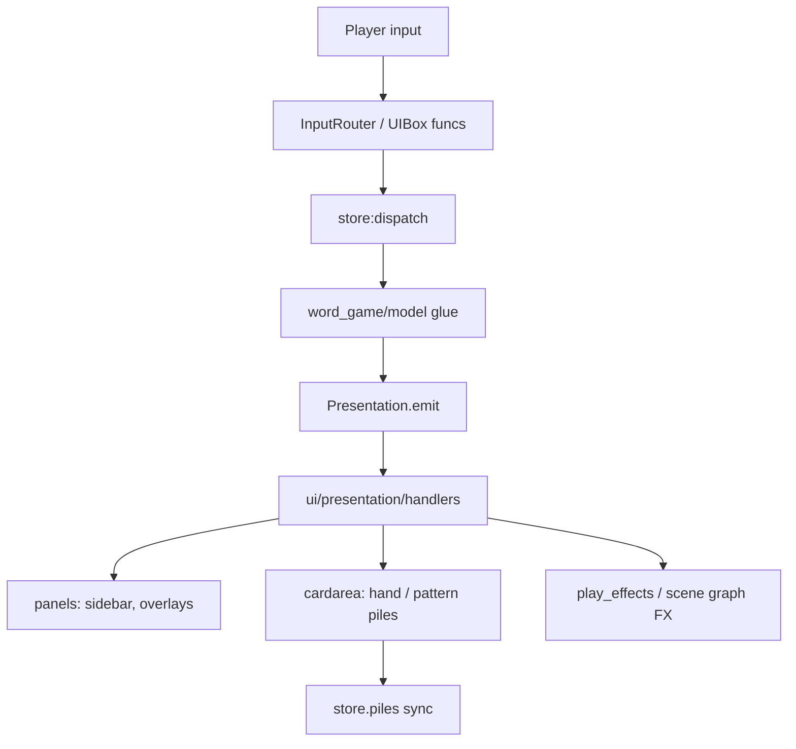

# UI stack — choose your layer

Jumbalaya has **three presentation paths**. They are not interchangeable — each owns a different kind of screen object.

```text
                    ┌─────────────────────────────────────┐
                    │         word_game/ui/               │
                    │  (game screens, FX, card chrome)    │
                    └──────────────┬──────────────────────┘
           ┌───────────────────────┼───────────────────────┐
           ▼                       ▼                       ▼
   jumbalaya-engine/panels   word_game/ui/cardarea   jumbalaya-engine/scene
   declarative HUD trees     draggable letter tiles   Sprite / Card nodes
```

## Decision tree

Start here when adding or moving HUD / table chrome:

| Question | Answer | Go to |
|----------|--------|-------|
| Need declarative buttons, labels, or a fixed HUD column? | Yes | **`jumbalaya-engine/panels`** — build a `Panel` / `ViewHost` tree from definition tables (`runtime().UI.ROOT`, `ROW`, `BUTTON`). Example: sidebar stamp grid, options overlay. |
| Need draggable letter tiles, piles, or snap-to-slot input? | Yes | **`word_game/ui/cardarea`** — `Card` + `CardArea` hosts (`dealt_letters`, `draw_pile`, `pattern_row.area`). Layout authority is still `store.piles`; sync hosts after mutations. |
| Need a one-off cinematic sprite, tween, or burst FX? | Yes | **Scene graph + `word_game/ui/play_effects`** — `Sprite` / `AnimNode` under the Game shell, or timed sequences in `play_effects/` and `feedback/`. |

**Not sure?** If it has **hit targets and layout from a definition table** → panels. If it **moves between piles and snaps to puzzle slots** → cardarea. If it **plays once and disappears** → scene graph / play effects.

## How the three paths cooperate



- **Panels** — retained widget trees; relayout when `LayoutRequest.refresh()` or a presentation handler says so. Store-backed views (`word_game/ui/views/*`) subscribe for render revision only.
- **Cardarea** — live `Card` instances on `CardPile` hosts; model deals and moves via `piles.move_card` / `sync_hosts_to_store`.
- **Scene graph / play_effects** — cinematics (card fly-off, boss intro, confetti). May enqueue on `TIMELINE` or `timeline_scheduler`; must not own authoritative run state.

## Model → UI notifications

Model glue **never** imports `word_game/ui/` or calls `WORD_GAME_UI`. It notifies through:

| Mechanism | When |
|-----------|------|
| `Presentation.emit(event, …)` | HUD refresh, boss intro, timeline sync, play resolved — catalog in `types/presentation_events.lua` |
| `LayoutRequest.refresh()` | Deferred TABLE_BOARD relayout (`ARGS.pending_layout`; consumed in `table/board.lua`) |
| `model/feedback.lua` queue | Ephemeral sentences drained by `word_feedback` each frame |

`Funcs.dispatch` is for **shell/widgets** (overlays, profile, settings) — not model notifications.

## Examples in this repo

| Feature | Layer | Module |
|---------|-------|--------|
| Right-hand sidebar HUD | panels | `word_game/ui/sidebar/` + `views/sidebar_view.lua` |
| Play / shuffle buttons | panels | `table/controls/definition.lua` (UIBox nodes beside hand) |
| Dealt hand + pattern row | cardarea | `ui/cardarea/hand.lua`, `ui/cardarea/placement.lua` |
| Boss-word 3-2-1 countdown | play_effects + feedback | `play_effects/boss_word_intro.lua`, `feedback/word_feedback.lua` |
| Token fly to sidebar | scene graph FX | `table/token_reward.lua` |
| Fuse slider | panels + custom draw | `perks/timeline_timer/` |

## Further reading

- Package map and dependency rules: [`code-organization.md`](code-organization.md)
- Presentation event catalog: `types/presentation_events.lua`, `test_presentation_catalog.lua`
- Glue headers and circular-deps exceptions: [`code-organization.md` § Phase 10a](code-organization.md#phase-10a-glue-hygiene-ongoing)
